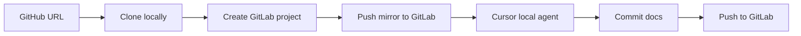

# Open Source Code Documenter

Mirror a GitHub repository to a GitLab namespace, then use a **Cursor agent** to add extensive, beginner-friendly documentation (README overhaul, `docs/` guides, inline comments, Mermaid diagrams, and more). The documented result is pushed back to GitLab.

Available as an **Electron desktop app** and as a **web UI** served by the same Express backend.

## How it works



1. You provide a GitHub repo URL and GitLab namespace.
2. The app clones the repo, creates (or reuses) a GitLab project, and pushes an initial mirror.
3. A **local** Cursor agent runs against the clone with a detailed documentation prompt.
4. Changes are committed and pushed to GitLab.

> **Note:** Cursor cloud agents currently clone **GitHub** repos only. This app uses a **local** Cursor agent on the cloned copy so the final documented repo lives on **GitLab** as requested.

## Prerequisites

- **Node.js** 20+
- **Git** installed and on `PATH`
- **Cursor API key** — [Cursor Dashboard → Integrations](https://cursor.com/dashboard/integrations)
- **GitLab personal access token** with `api` and `write_repository` scopes
- A GitLab **group or username** (namespace) where projects can be created

## Setup

```bash
cp .env.example .env
# Edit .env with your credentials

npm install
```

### Environment variables

| Variable | Description |
|----------|-------------|
| `CURSOR_API_KEY` | Cursor user or service-account API key |
| `GITLAB_TOKEN` | GitLab PAT (`glpat-...`) |
| `GITLAB_HOST` | GitLab instance URL (default: `https://gitlab.com`) |
| `GITLAB_NAMESPACE` | Target group path or username |
| `PORT` | API server port (default: `3847`) |

You can also enter API keys in the UI (they are sent to your local server only and are not stored).

## Usage

### Desktop (Electron)

```bash
npm run dev
```

This starts the API server, Vite dev frontend, and Electron window.

### Web only

Terminal 1 — API + built frontend:

```bash
npm run start:web
```

Or for development with hot reload:

```bash
# Terminal 1
npm run dev:server

# Terminal 2
npm run dev:client
```

Open [http://localhost:5173](http://localhost:5173) (dev) or [http://localhost:3847](http://localhost:3847) (production).

The web and desktop UIs share the same React frontend and REST/SSE API.

## API

| Method | Path | Description |
|--------|------|-------------|
| `GET` | `/api/health` | Health check |
| `GET` | `/api/config` | Non-secret config defaults |
| `POST` | `/api/jobs` | Start a documentation job |
| `GET` | `/api/jobs/:id` | Job status |
| `GET` | `/api/jobs/:id/stream` | SSE live updates |

### Example

```bash
curl -X POST http://localhost:3847/api/jobs \
  -H "Content-Type: application/json" \
  -d '{"githubUrl": "https://github.com/owner/repo"}'
```

## Documentation scope

The Cursor agent is instructed to produce documentation far beyond typical OSS repos:

- Root README with architecture diagram, glossary, and tutorials
- `docs/` guides (`ARCHITECTURE.md`, `CONCEPTS.md`, `GETTING_STARTED.md`, etc.)
- Inline docstrings/comments across the codebase
- Per-module READMEs where appropriate
- `CONTRIBUTING.md`

Runs can take a while on large repositories because the agent explores and edits many files.

## Project structure

```
electron/          # Electron main & preload
src/server/        # Express API, GitLab/GitHub services, Cursor agent
src/client/        # React UI (Vite)
data/workspaces/   # Temporary clone directories (gitignored)
```

## License

MIT
